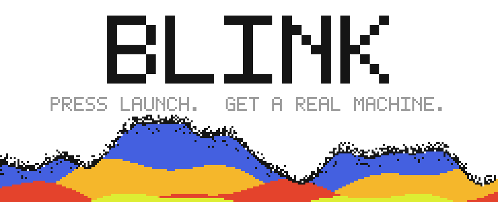
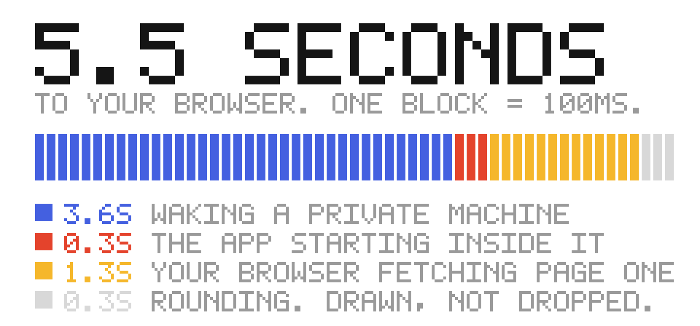
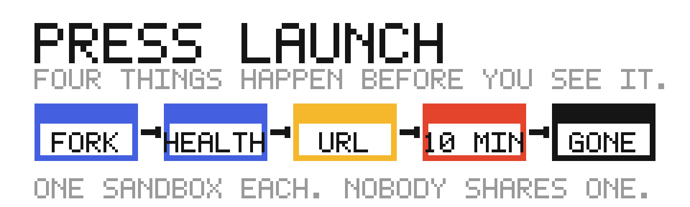
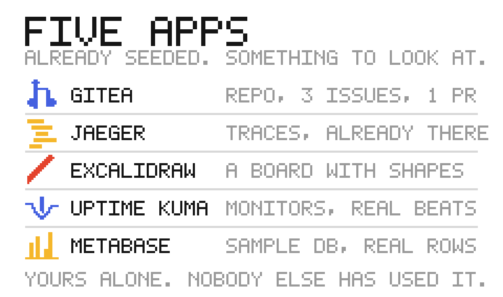
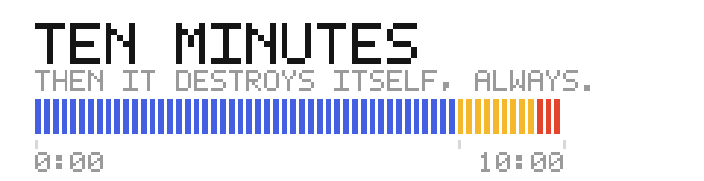
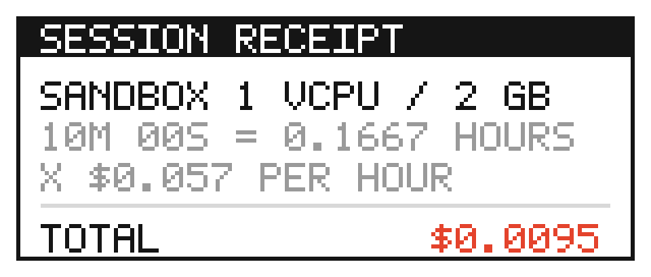

<p align="center">
  
</p>

# Blink

Pick an open source app, press Launch, and a private Linux machine wakes up with
that app already running and already full of data. Yours alone for ten minutes.
Then it destroys itself and tells you what it cost.

Each instance is a [Solari](https://docs.getsolari.com) sandbox forked from a
snapshot and served over `previewUrl`. Not a shared demo that gets wiped between
visitors: one machine, forked for you, destroyed after you.

**Live at [blink.utkarshbahuguna.me](https://blink.utkarshbahuguna.me)**, running
from a laptop behind a Cloudflare Tunnel. Said here rather than left to be
discovered, because it is why the site can be asleep.

<p align="center">
  
</p>

Every timing is published as its parts, because a total hides which part you are
waiting for. The app is the fastest thing in that bar.

## How a launch works

<p align="center">
  
</p>

The snapshot already holds the app, its data and its warm memory, so nothing
installs and nothing seeds while you wait. The health check runs over loopback
**inside** the machine, because the first version measured the internet and
blamed the app.

Your ten minutes start at handover, not at fork. An instance that was ready three
minutes before you could use it has not been yours for three minutes.

## The catalog

<p align="center">
  
</p>

Every app is seeded at build time, and each card decides where it drops you:
Gitea on its issue list, Jaeger on a search with traces already in range, Uptime
Kuma on the dashboard. A card that does not match its arrival does not ship.

## Ten minutes, then it is gone

<p align="center">
  
</p>

Three independent layers, because any one of them can be the thing that fails:
an in-process sweeper; `blink-boot arm` inside the guest, which needs no server
to be alive; and a 180 second `onTimeout: "kill"` deadline pushed out by a 45
second heartbeat, so a server that dies leaves sandboxes running for three
minutes rather than twelve.

## What broke

The useful bugs all had one shape: a control that exists, passes its own test,
and cannot fire.

Turnstile was complete, tested and mapped to four threats, with no widget on the
page. Every card photographed a deep, populated screen while the handover dropped
visitors at `/`. A watchdog reaped a live instance 2 ms before handover, because
a live instance is in the ledger and that is exactly what the reaper reads as
proof it should die.

**[The catalogue is in `docs/06-what-broke.md`](docs/06-what-broke.md)**, with the
three times a published number turned out to be derived rather than measured.
Each of those made Blink look worse than it is, and no test caught any of them,
because all three produced entirely plausible numbers.

## The documents

| Doc | What it is |
|-----|------------|
| [`00-verification.md`](docs/00-verification.md) | 114 rows. Every claim checked against a live source, with the verdict, the evidence and the cost. |
| [`06-what-broke.md`](docs/06-what-broke.md) | The bugs, and what separates them. |
| [`01-prd.md`](docs/01-prd.md) | Requirements, budget model, open questions. |
| [`02-architecture.md`](docs/02-architecture.md) | 8.1 is the counting fetch, 8.2 is the three-layer expiry. |
| [`03-security-and-access.md`](docs/03-security-and-access.md) | T1 to T12, for a site that hands strangers a Linux sandbox on one key. |
| [`04-frontend-spec.md`](docs/04-frontend-spec.md) | Frontend spec, and where the published timings come from. |
| [`05-control-audit.md`](docs/05-control-audit.md) | Each control, and the test that proves it fires. |
| [`gates/`](docs/gates/) | Eight gates, the questions they answer, and their live reports. |

## Run it

Node 24, so there is no build step.

```
npm install
cp .env.example .env      # then fill in SOLARI_API_KEY

npm run web               # the site
npm test                  # 411 tests against fixtures, zero credits
```

Gates and snapshot recipes spend real money, so both are opt in and both print
what they will cost before they start. See [`docs/gates/`](docs/gates/).

## Status

Five apps built and seeded, eight gates run live, site deployed and self
restarting. 411 tests pass against fixtures, so CI spends nothing.

<p align="center">
  
</p>

The ledger records **812 sandboxes**, none still live: 330 soak, 247 canary, 167
gates, 50 real launches, 37 snapshot builds. An exact all-time total is **not**
reconstructible, and that is a gap rather than an omission: `SandboxLedger`
writes an open and a close per sandbox but never a cost, so the file that knows
every sandbox existed cannot say what any of them cost. `src/billing/` is what
fixes that for the product.

The order-of-magnitude answer, which is what the number is for, is that the whole
project has cost well under a dollar.
