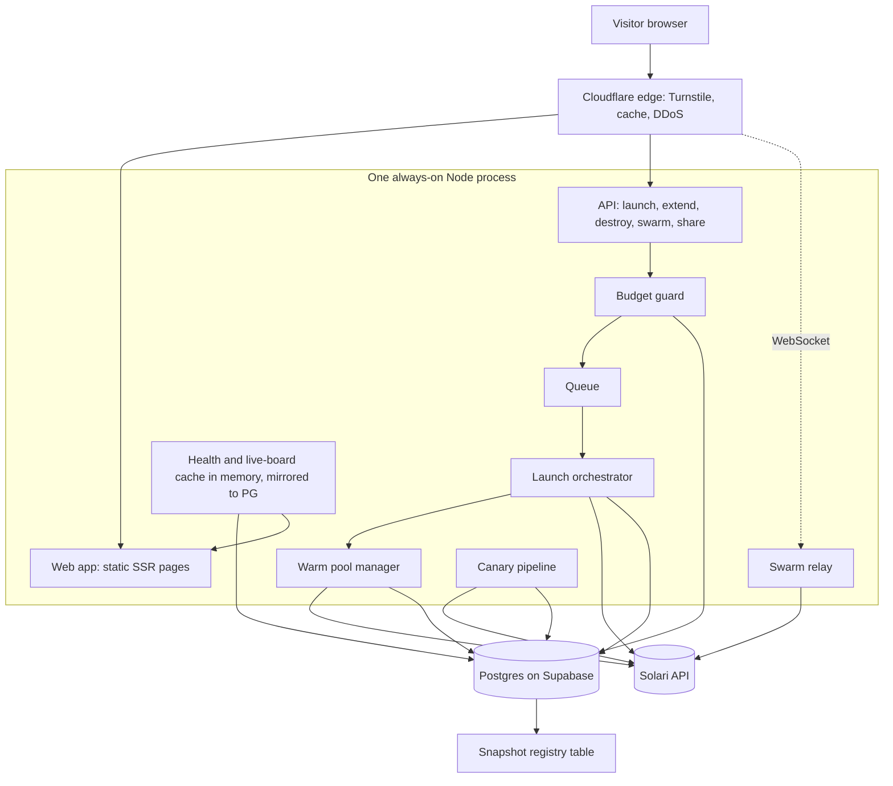

# Blink: Technical Architecture

Language: TypeScript. The Solari TS SDK (`@solarisdk/sandbox`, `@solarisdk/browser`) is the reference implementation, and the Swarm relay needs long-lived WebSockets in the same process that holds the CDP connections. Python (`solari-sandbox`, `solari-browser`) is acceptable if the developer overrides, at the cost of rewriting the relay.

Both package names are confirmed: `@solarisdk/sandbox@0.1.2` and `@solarisdk/browser@0.1.3`, with TypeScript and Python documented as being "at full parity" (`00-verification.md` V1, V2). Two consequences worth stating at the top because they shape `src/solari/`:

- **The adapter takes an API key per call.** It never reads `SOLARI_API_KEY` from the environment at the call site. This is Q6 insurance and it is free to honour from the start. See `01-prd.md` section 10.1.
- **Every Solari HTTP request goes through one injected `fetch`.** The SDK's `HttpTransport` retries idempotent requests five times by default and `SandboxClient` exposes no option to disable it (V15). The injected `fetch` is the only place that sees every real attempt, so it is where the retry cap, the budget guard, the per-call deadline and the ledger all live. Section 8 specifies it.

The browser SDK types import from `patchright-core`, a Playwright fork, not from `playwright` (V18). That is the dependency the relay and G5 build against.

## 1. Components



Everything except the visitor browser, Cloudflare, Postgres, and Solari lives in one process. That is deliberate: the relay must share memory with the orchestrator, the warm pool must not race a second instance of itself, and the hosting budget does not stretch to a cluster. Postgres holds all state, so the process is restartable at any moment (section 10).

## 2. Sequences

Costs below use Starter rates ($0.057/h for 1 vCPU / 2 GB, $0.114/h for 2 vCPU / 4 GB, browsers $0.10/h) and Free rates ($0.0855/h, $0.171/h, browsers $0.15/h).

### 2.1 Launch, warm path (D2)

1. `POST /api/launch {appId}` with a Turnstile token. Cloudflare validates.
2. Budget guard checks per-launch, per-IP-per-day, and global-per-day ceilings against `budget_ledger`. Refuse here or never.
3. Orchestrator claims a `warm_fork` row for the app with `SELECT ... FOR UPDATE SKIP LOCKED`, status `ready`.
4. `sandbox.resume()` on the handle. Timer state becomes `resuming`. Resume "re-acquires a concurrency slot, opens a fresh billing segment, and returns a fresh `controlUrl`", so any cached control URL is invalid from this point and must not be reused (V19).
5. **Health check over loopback inside the guest**, via `commands.run`, not through `previewUrl`: `curl -sf http://127.0.0.1:<port><health_path>` in a poll loop, up to 15 s at 250 ms intervals. G5 measured preview-domain overhead in the hundreds of milliseconds for a trivial static file, and the poll loop is up to 60 requests, so routing that loop through `previewUrl` would inflate fork-to-healthy by a cost the visitor never pays as part of the fork. The loopback figure is the app's own service time, which is what "healthy" should mean.
6. **The `previewUrl` is already in hand: it was resolved at replenish time, not now.**

   > **CONFIRMED, 2026-09-03, by the corrected G3 route experiment.** A URL resolved before the pause still routes to the sandbox after the resume: 1,152 ms first byte with no re-resolve, and the preview host is unchanged. The earlier version of that experiment resolved a *fresh* URL and compared hostnames, which proved something weaker; hitting the pre-pause URL directly is what settled it.
   >
   > The saving is larger than the cold figure suggests. `previewUrl()` measures about 300 ms on a fresh sandbox but **1,238 to 1,344 ms after a resume** on both apps, so resuming rebuilds the route server-side and the warm path is exactly where the call is expensive. Pre-resolving removes that from the visitor's clock.

   The saving is only possible because of a measurement: G3's route-survival experiment recorded `hostChanged: false` across a pause and resume, so a URL resolved before pausing is still the right URL after resuming. The warm-pool replenisher therefore resolves it in step 7 below and stores it on the `warm_fork` row, and the claim path skips a **1,035 ms** API round trip entirely.

   Handover fires here, on health. Measured warm path: `resume 3,408 ms + health 281 ms = 3,689 ms to ready`, with the visitor's own browser paying a further 1,354 ms for its first byte, so **about 5.0 s until they see the app**.

   **Token freshness, and why this is not simply free.** The URL carries a one-hour `pt_token` (V21) and a warm fork can sit paused for longer than that. So the claim path checks `preview_resolved_at`: if it is older than **50 minutes**, the URL is re-resolved before handover, which costs the 1,035 ms back and makes that launch 4.7 s to ready. The reconciler also refreshes any warm fork whose URL is approaching the hour, so a stale URL is normally impossible rather than merely handled.

   **The new failure mode, which is real and did not exist before.** Handing over a pre-resolved URL means the visitor can be told "ready" and then find the URL does not work, because the check that used to prove it worked (resolving it fresh) no longer happens on their path. Three cases:

   - **Stored URL is stale but the sandbox is fine.** The visitor's first request returns 401. The instance page detects that and calls `POST /api/instances/:id/refresh-url`, which re-resolves **once** and updates the toolbar link in place. This is a single re-resolve on a read-class call, not a retry loop: it happens once, on an explicit signal, and if it fails the next case applies.
   - **Re-resolve fails.** The instance is alive, healthy, and unreachable, which is the worst combination because it bills while being useless. **The instance is killed**, not retried. The toolbar says `We could not open a door to your instance, so we destroyed it rather than leave it running.` and offers a fresh launch. The receipt shows the seconds actually consumed, and the failure is written to the public canary log, because a silent kill is exactly the kind of thing this project claims not to do.
   - **The visitor never loads the URL at all.** Indistinguishable from a visitor who wandered off, and treated the same way: the instance expires normally under the three-layer scheme.

7. Background: fork a replacement from the app snapshot, health check it, **resolve its `previewUrl` and store it with `preview_resolved_at`**, pause it, insert a new `warm_fork` row. The URL resolution happens here precisely so it does not happen on a visitor's clock. Its first byte is timed as its own number and reported beside the fork time, never folded into it (G1 reports fork, health-complete and previewUrl-first-byte separately). Note the shape: `previewUrl(port): Promise<{url: string; token?: string}>` returns an **object**, not a string, and it is an instance method on the handle taking only a port (V5). The returned URL carries a one-hour `pt_token` query parameter (V21), so it must be re-resolved rather than cached beyond that window, and it is a bearer capability: see `03-security-and-access.md` T5. Timer freezes. Visitor is handed the URL. Path recorded as `warm`.
8. Cost: 10 min of 1 vCPU / 2 GB. Starter 0.057 / 6 = $0.0095. Free 0.0855 / 6 = $0.0143. The replacement fork's own health check costs about 30 s of runtime before pausing: Starter 0.057 x (30/3600) = $0.00048, Free $0.00071.

### 2.2 Launch, cold path

Steps 1 and 2 as above. Then:

3. `sandbox.create({fromSnapshot: snapshotId, cpu, memMb, timeoutMs: 180_000, lifecycle: {onTimeout: "kill"}, metadata: {...}})`. Timer state `forking`. `timeoutMs` is 180 s, not a value above the instance lifetime: it is an idle timer refreshed by a server heartbeat, which is backstop B in section 8. `metadata` is set on every sandbox so the reconciler and the sweeper can find orphans with `list({metadata})` (V14).
4. Health check over loopback, **and `previewUrl()` resolved concurrently with it**, not after. There is no stored URL on the cold path, so the call has to happen on the visitor's clock; running it alongside the health check means the pair costs `max(health, resolve)` instead of their sum. On the measured cold numbers the health check is the slower of the two, so the resolve is effectively free. Handover waits for both, since both are genuinely required.

   Note the honest limit on that figure: G1's first run measured resolve and first byte as one number, so the cold split between them is inferred rather than measured. The instrumentation is fixed and the next cold run reports them separately. **Correction, and it changes what G1 is expected to show.** This step previously read "typically longer because the app process starts from a cold filesystem rather than a resumed memory state". That reasoning is wrong. Solari snapshots are documented as carrying both: "Every snapshot is self-contained, it carries its own complete disk and memory image" (V22). A cold fork therefore restores memory state too, and may land within noise of a warm resume. That possibility is not a footnote, it is a build decision: see the G1 kill criterion in `01-prd.md` section 9, which deletes the warm pool from v1 if cold p95 is within 500 ms of warm p50.
5. Same handoff. Path recorded as `cold`, and the UI says so before the timer starts, not after.
6. Cost: identical per minute to the warm path. The difference is time-to-ready, not money.

### 2.3 Extend

`POST /api/instances/:id/extend`. Guard checks the per-launch ceiling of 1200 sandbox-seconds. `expires_at = expires_at + 600s`, and the guest-side self-destruct deadline is pushed by the same 600 s over the control channel. One extension per instance, enforced by `extensions_used`. Note that `setTimeout(timeoutMs)` is **not** how lifetime is extended: it moves an idle window, not a wall clock (section 8), and the heartbeat already keeps it refreshed at 180 s regardless. Cost: another 10 minutes, Starter $0.0095, Free $0.0143.

### 2.4 Destroy

`POST /api/instances/:id/destroy` or the expiry sweeper. `sandbox.kill(sandboxId)`, write `ended_at`, compute the receipt from `ended_at - ready_at` plus any Swarm browser-seconds, mark the slot free, wake the queue. Cost: stops the meter.

### 2.5 Canary run (D1, D10)

Hourly, one rotating app so all five are covered every five hours. Fork from the app's current snapshot, health check, take a screenshot through one Solari browser for the catalog card, kill. Writes a `canary_run` row and a public log line. Cost per run at 60 s sandbox plus 20 s browser: Starter (0.057 x 60/3600) + (0.10 x 20/3600) = $0.00095 + $0.00056 = **$0.0015**. Twenty-four runs per day = **$0.036/day**, $1.08/month. On Free, reduced to every 6 hours: 4 x [(0.0855 x 60/3600) + (0.15 x 20/3600)] = 4 x ($0.00143 + $0.00083) = **$0.009/day**.

### 2.6 Warm-pool replenish

Triggered after a warm fork is claimed, on boot, and by a 60-second reconciler. Fork from snapshot, health check, `sandbox.pause(sandboxId)`, insert `warm_fork`. If the fork returns 429 (concurrency), do not retry: mark the app's warm fork as `unavailable` and let the next launch take the cold path (G7, D7). Cost is the health-check window only. Q1 is resolved: paused sandboxes do not bill and do not hold a concurrency slot (V19, V20), so a warm fork at rest is free. Roughly 30 s of running time per replenish, $0.00048 at Starter.

### 2.7 Swarm run (D6, v1.5)

1. `POST /api/instances/:id/swarm {n}`. Guard: instance belongs to this session, one run per instance per 2 minutes, n <= 12 on Starter and <= 3 on Free, 45-second hard cap.
2. Launch n browser sessions through `@solarisdk/browser`, collect CDP endpoints, connect over WebSocket.
3. Per tile: `Page.enable`, `Page.navigate(previewUrl)`, `Page.startScreencast({format:"jpeg", quality:60, maxWidth:480, everyNthFrame:2})`.
4. Frames are acknowledged with `Page.screencastFrameAck` and forwarded to the visitor's WebSocket as binary.
5. On load, `Runtime.evaluate` reads `performance.getEntriesByType("navigation")[0]` for `responseEnd` and `loadEventEnd`.
6. Final screenshot per tile, perceptual hash, compare against the majority hash, set the consistency flag.
7. Kill all sessions at 45 s or on visitor disconnect.
8. Cost: 12 x 45 s = 540 browser-seconds = 0.15 h. Starter 0.15 x 0.10 = **$0.015**. Free 3 x 45 s = 135 s = 0.0375 h x 0.15 = **$0.0056**. No proxies, so $1.00/GB never applies.

### 2.8 Fork-my-state (D9, v1.5)

`sandbox.snapshot(name)` on the visitor's live sandbox. Confirmed to work on a running session without killing it first: "Checkpoint this RUNNING session; it keeps running. Returns the snapshot id" (V6). Insert `share_snapshot` with a random 16-byte id and `expires_at = now + 7 days`, return `/s/:token`. Opening the link runs the cold launch path with `fromSnapshot` set to the share snapshot and increments `fork_count`. Snapshot creation cost is the sandbox time it consumes plus storage against the Starter snapshot allowance (G4, Q2, both still unmeasured).

**Hard cap: at most 12 live share snapshots at any time (Q18).** G4 measured a snapshot of a bare `base` template at about **3.84 GB**, and a seeded app snapshot will be larger. Snapshot storage appears on **no** billable line item in Solari's pricing (`00-verification.md` V56), so it is either free or unlisted, and the budget guard's ceilings are denominated in sandbox-seconds and browser-seconds and would not catch it either way. 12 is chosen from G4's evidence: no count ceiling was reached at 5, so 12 is comfortably inside anything observed, and at roughly 46 GB it is a bounded exposure whatever the rate turns out to be. Reaching the cap refuses new share links with a plain message rather than evicting someone else's.

**The expiry sweeper is proven, not assumed.** It is implemented in `src/share/expiry.ts` and driven to fire in `test/controls-fire.test.ts`, including the failure path where a delete that fails must not mark the row deleted, since that would retire bytes that are still on disk and unreachable from any record. See `05-control-audit.md`. A leaked snapshot is GB-scale, not a stray row, so the 24-hour soak checklist (section 13) gains an explicit item: create a share snapshot, expire it, and verify by `listSnapshots()` that the bytes are gone. Deletion is documented as erasing stored bytes immediately, and G4 confirmed the one failure mode it has:

Expiry deletes the snapshot, and the sweeper must handle one documented failure rather than assume success: deletion is refused with `409 SnapshotHasChildren` while any forked sandbox still depends on it, and `409 SnapshotBacksTemplate` if it backs a template (V23). Instances live 20 minutes at most, so the conflict is transient, but a 409 is a normal outcome to be re-queued for the next sweeper tick, never retried in place.

## 3. Data model

| Table | Key columns |
|-------|-------------|
| `app` | `id`, `name`, `category`, `port`, `health_path`, `cpu`, `mem_mb`, `try_first` (jsonb, three steps), `license`, `upstream_url`, `screenshot_url`, `enabled` |
| `snapshot` | `id` (Solari snapshot id), `app_id`, `version`, `built_at`, `size_bytes`, `canary_status`, `is_current` |
| `warm_fork` | `id`, `app_id`, `snapshot_id`, `sandbox_id`, `status` (`building`, `ready`, `claimed`, `dead`), `paused_at`, `claimed_at`, `preview_url`, `preview_resolved_at` |
| `instance` | `id`, `app_id`, `sandbox_id`, `preview_url`, `path` (`cold`/`warm`), `requested_at`, `started_at`, `ready_at`, `expires_at`, `ended_at`, `extensions_used`, `ip_hash`, `timings` (jsonb), `end_reason` |
| `queue_entry` | `id`, `app_id`, `session_token`, `enqueued_at`, `position`, `est_wait_s`, `state` (`waiting`, `promoted`, `abandoned`, `refused`) |
| `canary_run` | `id`, `app_id`, `snapshot_id`, `started_at`, `fork_ms`, `health_ms`, `ok`, `error`, `screenshot_url` |
| `swarm_run` | `id`, `instance_id`, `n`, `started_at`, `ended_at`, `p95_load_ms`, `consistency_ok`, `browser_seconds` |
| `swarm_tile` | `id`, `swarm_run_id`, `idx`, `session_id`, `response_end_ms`, `load_event_ms`, `phash`, `matches_majority`, `error` |
| `share_snapshot` | `token`, `snapshot_id`, `app_id`, `created_at`, `expires_at`, `fork_count`, `reported`, `takedown_at` |
| `budget_ledger` | `id`, `day`, `scope` (`global`/`ip`/`launch`), `scope_key`, `sandbox_seconds`, `browser_seconds`, `usd_estimate` |
| `metric_sample` | `id`, `app_id`, `path`, `fork_ms`, `health_ms`, `total_ms`, `at` |
| `plan_config` | `plan`, `sandbox_vcpu_rate`, `sandbox_gb_rate`, `browser_rate`, `max_sandboxes`, `max_browsers`, `swarm_max_n`, `warm_pool_enabled`, `ceilings` (jsonb) |

`plan_config` exists so that the Starter to Free downgrade is a row update, not a code change (PRD risk table, Q12).

```json
// instance
{ "id": "ins_9f2", "app_id": "gitea", "sandbox_id": "sbx_a11",
  "preview_url": "https://...", "path": "warm",
  "requested_at": "2026-09-10T12:00:00.000Z", "ready_at": "2026-09-10T12:00:01.140Z",
  "expires_at": "2026-09-10T12:10:01.140Z", "extensions_used": 0,
  "timings": { "queue_ms": 0, "resume_ms": 780, "health_ms": 360, "total_ms": 1140 } }

// swarm_tile
{ "swarm_run_id": "swm_31", "idx": 7, "response_end_ms": 210,
  "load_event_ms": 640, "phash": "e3a1...", "matches_majority": true }

// budget_ledger
{ "day": "2026-09-10", "scope": "global", "scope_key": "*",
  "sandbox_seconds": 6120, "browser_seconds": 540, "usd_estimate": 0.1119 }
```

## 4. Warm pool manager

States per fork: `building` (fork issued, health check pending), `ready` (paused, health-checked), `claimed` (resumed for a visitor, now an `instance`), `dead` (Solari reports it gone, or health check failed).

Policy: keep one `ready` fork per enabled app, capped by the plan. Replenish on claim, on boot, and on a 60-second reconciler that lists Solari sandboxes and compares against `warm_fork` rows. Any sandbox Solari knows about that Blink does not is killed. Any row Blink holds that Solari does not is marked `dead`.

At the concurrency limit: paused forks do not count against the limit (D3), confirmed verbatim as "A paused sandbox doesn't count against your plan's limit on running sandboxes; resuming it counts again" (V20), but the transient forking of a replacement does. A 429 during replenish is treated as a guard bug, logged, and never retried in a loop (D7, G7). The app simply has no warm fork until the next reconciler tick, and its next launch is cold and labelled cold.

Under Free: `warm_pool_enabled = false`. One sandbox slot means a warm fork would starve real launches during replenish. Free launches are always cold, and the site says so.

The `demo_window` mode that used to live here is deleted. It was a contingency against paused forks billing, and Q1 resolved: they do not bill (V19). A warm fork at rest is free and slot-free, so there is no reason to run the pool on a schedule.

**The warm pool's surviving risk is that it is worth nothing.** Snapshots restore memory as well as disk (V22), so a cold fork may be nearly as fast as a warm resume. G1 decides it: if cold p95 lands within 500 ms of warm p50, this entire section is deleted from v1 along with D2, the replenish path and the reconciler's warm-fork half, and the cold number becomes the headline. That verdict is printed by the G1 report, not inferred. See `01-prd.md` section 9.

Recovery after restart: the reconciler runs before the API accepts traffic. Live `instance` rows are re-checked against Solari; any whose sandbox is gone are closed with `end_reason = "lost"`, and the visitor page shows the honest message plus the partial receipt.

## 5. Snapshot build recipes (D1)

Base template: `base`, documented as "the standard headless sandbox (the sandbox default)". Q15 is resolved and the answer is bare: `base` ships **neither a JRE nor Node**. Node appears only in the `code` template, which is a *desktop*, not a headless sandbox, and no template mentions a JRE (`00-verification.md` V38). Both are installed at snapshot build time, or folded into a custom template, whose builder accepts apt packages, pip packages, shell commands, env vars and a working directory in that order. No Docker-capable template is documented (V39), so every recipe below targets a release binary or a static bundle, and that is now the only defensible path rather than a preference.

Pipeline per app: fresh sandbox from base template, run install, run seed, run health check, `snapshot("<app>-<version>-<date>")`, `kill`. Rebuilt on demand, verified hourly by the canary.

> **Every recipe command below goes through `sh -c`. This is not optional and it is not obvious.**
>
> The SDK's `commands.run(cmd)` executes the program directly and **not via a shell**. Its own type comment says so: *"Arguments passed to the program (the guest runs `cmd` with these, NOT via a shell). For shell syntax use `run("sh", { args: ["-c", "..."] })`."* So `&&`, `||`, `;`, pipes, redirections, globs, `$VAR` and heredocs are all passed as **literal arguments** and silently do nothing useful.
>
> Every install, seed and health line in the table below is written in shell and every one of them depends on this. It cost the first live gate run three different wrong answers from one cause (`00-verification.md` V17b), and the failures did not look related to each other: one gate reported a false negative on a security control, one measured a file that was never written, and one served a page that was never created.
>
> `src/solari/adapter.ts` wraps every `exec` in `sh -c` so no call site has to remember. Use `execRaw` only when passing untrusted arguments, where the absence of a shell is the point.
>
> Worked example, the Gitea install line from the table:
>
> ```ts
> // WRONG. `&&` is passed to curl as an argument. Nothing is extracted, and the
> // command reports success because curl itself exited fine.
> await sandbox.commands.run(
>   "curl -fsSL $URL -o gitea && chmod +x gitea && ./gitea --version",
> );
>
> // RIGHT, and what adapter.exec does for you:
> await sandbox.commands.run("sh", {
>   args: ["-c", "curl -fsSL $URL -o gitea && chmod +x gitea && ./gitea --version"],
> });
>
> // In the recipes, just call:
> await adapter.exec(apiKey, sandbox, "snapshot:gitea", installScript);
> ```
>
> A recipe that appears to succeed while doing nothing is the failure mode to watch for here. Assert on a real postcondition (a file exists, a port answers, a binary reports its version) rather than on the command's exit code.

| App | Install | Seed | Health | Port | Size | Notes |
|-----|---------|------|--------|------|------|-------|
| Gitea | Single static release binary `gitea-1.27.3-linux-amd64` from the Gitea download server, verified against the published `.sha256`, run with SQLite backend | Admin user via `gitea admin user create`, one repo pushed from a local fixture, three issues and one PR created through the Gitea API | `GET /api/healthz` | 3000 | 1 vCPU / 2 GB | Confirmed: v1.27.3 (2026-08-29) ships one static binary per platform with no runtime dependency (V45). Well inside 2 GB with SQLite. Rootless is fine. License MIT. |
| Jaeger 2.x all-in-one | `jaeger-2.20.0-linux-amd64.tar.gz`, which contains exactly two binaries, `jaeger` and `example-hotrod` | Run HotROD, drive a fixed number of requests with `curl` so traces exist before the snapshot | `GET /` on the query UI | 16686 | 1 vCPU / 2 GB | Confirmed and already proven on this account. Reuse thrice's recipe verbatim, including its pinned tarball SHA-256 `c967368b…2900d7`. Note the published `sha256sum.txt` checksums the **extracted binaries**, not the tarball, so verification is extract-then-verify (V46). License Apache 2.0. |
| Excalidraw | **Built from source in the sandbox, at the pinned tag `v0.18.1`.** Supersedes the CI-built-tarball plan below. Node 22.23.2 installed from the official tarball and checksum-verified, `git clone --depth 1 --branch v0.18.1`, then `yarn install` and `yarn build:app:docker`, which is `vite build` with `VITE_APP_DISABLE_SENTRY=true`, so a visitor's instance ships no error telemetry to a third party. The `examples/*` workspaces are removed before install: they pull an entire Next.js toolchain, including `@next/swc-*` binaries for four platforms this build never runs on, and they are what exhausted the disk on the first attempt (V62). | Welcome scene written to `scenes/welcome.excalidraw`, loadable the same way a shared link loads. Excalidraw keeps documents in `localStorage`, so there is no server-side document to seed | `GET /` returns 200 with the app shell | 8080 | **Built at 2 vCPU / 4 GB, served at 1 vCPU / 2 GB. See the deviation note below.** | Q14's premise has changed: the release still ships zero assets (V47), but a source build inside the sandbox turned out to be workable, which removes the CI dependency and the need to host a tarball ourselves. License MIT. |
| Uptime Kuma | Node application, v2.5.3. Node 22.23.2 installed and checksum-verified, `git clone --depth 1 --branch 2.5.3`, `npm ci --omit dev`, then `npm run download-dist`, which fetches the release's prebuilt `dist.tar.gz`. So there is no frontend build here at all, which is why this fits in 1 vCPU / 2 GB while Excalidraw needed 4 GB to build (V48, V38). | **Through the app's own socket.io API, not its SQLite file.** Uptime Kuma bcrypt-hashes passwords and dispenses rows through an ORM; writing the database directly means reimplementing both and being wrong when either changes. The recipe drives `setup`, `login` and `add` over the socket, then **reads the rows back out of `kuma.db`** rather than trusting the callbacks. | `GET /` returns the login page | 3001 | 1 vCPU / 2 GB | **Monitors point at loopback only, and that is a security requirement rather than a preference.** Uptime Kuma exists to make outbound requests on a schedule, and Q5 established egress from the guest cannot be restricted, so a monitor seeded with a third-party URL would point every instance Blink ever launches at someone else's server on a 60-second interval. Its UI is socket.io end to end, so **the recipe ends by forking its own snapshot and completing a WebSocket handshake through `previewUrl`**: no other app in the catalog needs an HTTP Upgrade, so no other recipe or gate tests one. License MIT. |
| Metabase | `metabase.jar` from **`https://downloads.metabase.com/v0.63.16/metabase.jar`**, not from GitHub: release v0.63.16 ships zero assets (V49). Needs a JRE installed first (V38). Run line is `java --add-opens java.base/java.nio=ALL-UNNAMED -jar metabase.jar` with `-Xmx2g`. | Ships with its own sample database, so seeding is only the initial admin user, scripted through the setup API | `GET /api/health` | 3000 | 2 vCPU / 4 GB | The only app that needs the larger size, and the size is now vendor-backed: Metabase documents a 1 core / 1 GB floor and recommends `-Xmx2g` on a 4 GB machine (V50). Q13's remaining risk is boot time and stability with the sample DB, measured during the day-5 recipe, not in a gate. **Record its snapshot size when the recipe runs (Q18).** It is the only 2 vCPU / 4 GB app here, so its memory image is roughly double the others before any JRE or sample database is counted. If its snapshot is much larger than the rest, that is a second independent reason to substitute it, alongside Q13. Substitute if it fails: a second Gitea variant with a large seeded repo, or `code-server`. Any substitution is recorded here with the measured reason. License AGPL, which is fine for a hosted demo but must be stated on the card. |

**Deviation: Excalidraw is built larger than it is served.**

Every other app in the catalog is built and served at the same size. Excalidraw is built at 2 vCPU / 4 GB and its snapshot is launched into 1 vCPU / 2 GB sandboxes.

The reason is that its build and its runtime are not the same program. Installing a monorepo's dependency tree and running a Vite production build is the heaviest thing in this repository; what comes out is a directory of static files, and serving those needs almost nothing. Sizing every visitor's instance for a build that happened once, weeks earlier, would multiply the cost of every launch for no benefit.

This is not a general licence to launch a snapshot smaller than it was built. Metabase measures 1486 MB resident under query load (Q13) and keeps its 4 GB. The rule is narrower: **a snapshot may be launched smaller than it was built only when the serving process is provably not the building process**, and the recipe proves it rather than asserting it. The step `prove the runtime survives the smaller machine it will be launched into` reads the static server's actual RSS from `/proc` and fails the build if it exceeds 512 MB, which is a quarter of the serving budget. If that check ever fails, the deviation is wrong and the build stops instead of shipping an app that will be killed under memory pressure in front of a visitor.

If any app fails its health check behind `previewUrl` (section 6), it is removed from the catalog with a public note rather than shipped broken.

## 6. previewUrl handling (G2, D5)

**What the measured number contains.** Fork-to-healthy as published in `01-prd.md` S2 is **fork or resume, plus health-complete over loopback**. The `previewUrl` first byte is a separate, separately reported number. This split exists because the two are different claims: one is how fast Solari forks a machine and starts an app, the other is how fast a request reaches it through the preview domain. Publishing their sum as "fork speed" would be claiming routing latency as Solari's fork performance, which is both wrong and unflattering to Solari. If G5 shows the preview overhead is per-request rather than one-off routing setup, the reveal on the instance page is bounded below by it regardless of fork speed, and `04-frontend-spec.md` section 10's recording beat is rewritten against the real number rather than an assumed sub-second one.

Q4 is resolved ahead of G2: a `previewUrl` is **not** public and not guessable. It is "a public URL for something the sandbox is serving on that port" that "carries a one-hour `pt_token` query parameter", also accepted as the header `x-pinetree-preview-token`, and an expired token returns 401 (V21). So the URL is a bearer capability with a built-in one-hour ceiling, which is shorter than any instance lifetime and is exactly the property `03-security-and-access.md` T5 assumed but could not confirm. It also means the URL must be re-resolved rather than cached across a pause and resume.

What G2 still decides, on day 1: fetch a `previewUrl` from the server and inspect `X-Frame-Options` and `Content-Security-Policy: frame-ancestors` on the response. Three outcomes:

- Headers permit framing: desktop shows the instance in an iframe with the toolbar above it, mobile still opens a new tab.
- Headers refuse framing: new tab only, plus a floating toolbar page that keeps the countdown, extend, invite link, Swarm, and destroy. This is the assumed default, so nothing depends on the iframe.
- Headers are configurable per app: prefer configuring the app (Gitea and Uptime Kuma both allow setting their own frame policy) rather than proxying.

A reverse proxy on the Blink server would let it strip headers, but it would put every visitor byte through one small VPS, add a round trip through the host region, and make the server a target. Estimated added latency is 40 to 120 ms per request depending on visitor and sandbox regions [UNVERIFIED, and now largely moot]. Solari serves a single region, `us-west` in N. California (V43), so a visitor far from it already pays that RTT to reach any instance, proxy or not. The proxy is rejected for v1.

Per-app caveats behind `previewUrl`: Gitea writes absolute URLs from `ROOT_URL`, which must be set to the `previewUrl` after the fork, not baked into the snapshot, so the boot script patches `app.ini` and restarts Gitea before the health check. Jaeger's UI uses relative paths and is safe. Uptime Kuma needs websockets to work through the preview domain [UNVERIFIED, and it is the first thing G2 should test]. Nothing in the published docs describes the preview domain's proxy behaviour for upgrade requests, so this stays a measurement. Metabase sets its own session cookie with `SameSite=Lax`, which is fine in a new tab and may break inside an iframe on a different origin. Excalidraw has no backend and no cookies.

## 7. Swarm relay (D6)

CDP parameters per tile: `format: "jpeg"`, `quality: 60`, `maxWidth: 480`, `maxHeight: 320`, `everyNthFrame: 2`, giving roughly 4 frames per second at about 15 KB per frame. Twelve tiles is 12 x 4 x 15 KB = 720 KB/s outbound, about 5.8 Mbps, and 32 MB for a 45-second run. That is the number G5 must confirm on the real host.

Backpressure: the relay only acknowledges a screencast frame after the visitor socket has drained below a watermark, which naturally throttles Solari's frame production instead of buffering. If a tile falls more than 2 seconds behind, its `everyNthFrame` is doubled for the rest of the run and the tile is marked degraded in the UI rather than silently thinned.

Timing capture uses Navigation Timing per tile, not relay-side wall clock, so the numbers describe the instance and not the relay. The consistency flag is a 64-bit perceptual hash of each tile's final screenshot; tiles within a Hamming distance of 6 of the majority hash are consistent, the rest are flagged with a thumbnail diff. The threshold is tuned during G5 against known-identical tiles.

Teardown: visitor disconnect, 45-second cap, or instance death all kill every browser session immediately. A run that leaks sessions is a credit leak, so kills are idempotent and repeated by a sweeper. Free-plan degradation: 3 tiles, one run per instance per 2 minutes, same caps.

## 8. Budget guard and queue (D7, D3)

### 8.0 Every read-check-write site is locked, and the key is stated

A race audit on 2026-09-03 implemented five unwritten sites the obvious way and raced each against its boundary condition. **All five admitted more than they should**, including the Solari concurrency cap, where over-admitting produces the 429 that D7 treats as a guard bug. The sixth site, the billing ceiling, was already live and raced too.

The fix is one primitive, `src/concurrency/scope-lock.ts`, and a stated key per site. The key matters as much as the lock: too broad and unrelated launches queue behind each other, too narrow and the callers that should exclude do not.

| Site | Key | Why that granularity |
|------|-----|----------------------|
| warm fork claim | `warm_claim\|<app_id>` | Same app must exclude; different apps must not |
| queue promote | `warm_claim\|<app_id>` | Consumes the same per-app resource, so shares the key deliberately |
| sandbox slot admit | `sandbox_slot\|global` | The Solari cap is per account. The only site where global is correct rather than lazy |
| share snapshot cap | `share_cap\|global` | Account-wide storage, but a separate key so a Share never queues behind a launch |
| per-IP daily count | `ip_day\|<day>\|<ip_hash>` | The hottest path, so the narrowest key correctness allows. The day is included so midnight rollover cannot contend |
| billing ceiling | `<day>\|<scope>\|<key>` | Enforced inside the ledger's store |

In production these become `pg_advisory_xact_lock`, which blocks and releases on COMMIT. Deliberately not `SERIALIZABLE`, which resolves the same race by aborting a transaction that then needs retrying, and there is no retry loop anywhere in this codebase.

**The lock is layered: memory in front, Postgres behind** (`src/concurrency/scope-lock.ts`). Memory first because `pg_advisory_xact_lock` is only correct with one caller per connection: two callers sharing a client both end up inside one transaction, the lock becomes re-entrant, and it excludes nothing while raising no error. A connection pool would fix that and introduce a subtler version, since a pooled connection can be returned mid-transaction by a caller that failed between BEGIN and COMMIT. One caller per key by construction is stronger than hoping connections come back clean.

The Postgres layer stays wired because the memory layer is correct only while Blink is one process (D11). Two things stop it rotting: the contract suite exercises `PostgresScopeLock` **directly**, with a connection per caller and never through the memory layer, and `BLINK_BYPASS_MEMORY_LOCK=1` sends every caller straight at Postgres so the cross-process path can be put under real concurrency deliberately.

### Promotion reserves, and replenishment yields

**Promotion reserves against the ledger rather than checking it.** Ceilings used to be checked at promotion while the guard reserved at launch, so an entry could pass promotion and be refused at reserve, leaving a warm fork claimed for a launch that never happened. The fork is the scarcest thing in the system, so the fix removes the failure rather than recovering from it: `promoteAndReserve` decides and reserves inside the same per-app lock, and a promoted entry is affordable by construction. The alternative, keeping promotion best-effort and adding a return-and-requeue path, was rejected because every undo path is a place to leak a fork, and fewer states beats more recovery.

The residual cost is that a reservation is held across the launch and must be settled at what was actually consumed if the launch fails. That is the orphan sweeper's existing job, so it is a failure mode the ledger already handles.

**Replenishment competes for the account-wide slot counter and always loses.** A per-app replenish cap was the right limit at the wrong scope: five apps each replenishing one fork respects "one per app" and still takes every slot, and the Solari limit is per account. Replenishment may now only start when it would leave at least `SLOTS_RESERVED_FOR_VISITORS` free afterwards, which on Starter's two slots means it runs only when both are free. A visitor must never wait behind the pool refilling itself, and a 429 on the visitor path is a guard bug (D7), not a condition to handle.

### "day" means UTC, and the process asserts it

`day` appears in the per-day ceilings, the `ip_day` lock key, the `budget_ledger` day rows, and the public per-day percentiles. It is **UTC** everywhere: ceilings pace spend against Solari's monthly cycle rather than an operator's wall clock, and visitors are global, so any local midnight gives some of them two allowances in a calendar day and others one.

`assertUtcDayBoundary()` runs at startup and refuses to boot on a non-UTC process. It is asserted rather than assumed because this exact bug already happened once: node-pg parses a `date` into a JS Date at local midnight, and `toISOString()` then shifted the day backwards east of UTC. The fix is at the driver boundary (`src/db/pg-types.ts` registers a parser so a `date` stays the string Postgres sent) rather than only at the formatting call site, because the next `date` column would otherwise reintroduce it silently.

The guard is thrice's guard with an added scope. Every mutating call passes through `check(scope, cost)` before any Solari call. Ceilings are in `plan_config`, in sandbox-seconds and browser-seconds, never in dollars, so a price change is a config edit. Note the gap that leaves: a cost with no time dimension, such as snapshot storage (Q18), is invisible to a ceiling expressed in seconds. D9's snapshot cap in section 2.8 exists because of exactly that gap.

**Every ledger row records whether its seconds were measured or modelled.** A row is `measured: true` when the seconds came from an observed lifetime, `false` when they came from a flat estimate. This is public-facing rather than internal bookkeeping: **Solari exposes no balance or usage endpoint** (V55), so there is nothing to reconcile the ledger against programmatically, and remaining credit is visible only on the console Billing page. The credit gauge (D10, F9) is therefore a projection, not a reading. It is **labelled an estimate on the page**, reconciled by a manual console read at a stated cadence, and every gate report prints its measured-versus-modelled split so a drifting model is visible rather than silent.

### 8.1 The counting fetch: one choke point

The SDK's `HttpTransport` retries idempotent requests up to five times by default, with exponential backoff of 150, 300, 600, 1200, 2400 ms plus jitter. `SandboxClient.create()` sends an `Idempotency-Key` on every call, which makes it retry-eligible, and `SandboxClientOptions` is only `{apiKey, baseUrl, fetch?, callTimeoutMs?}`, so **`maxRetries` cannot be turned off through the SDK's public options** (`00-verification.md` V15, C-2). A silently retried create can therefore consume six gateway attempts and eight seconds without the guard or the launch timer knowing.

The `fetch` option *is* exposed, and it is the only place in the process that sees every real HTTP attempt. So it becomes the single choke point where four things live:

1. **The retry cap**, per call class. `0` during gates, so G1 measures real latency rather than a retried one. `1` for `create`, because the idempotency key makes exactly one 503 retry worth having. `0` for anything that spends money without an idempotency key. A cap breach throws rather than sleeps.
2. **The budget guard.** Refuse before the call, never after, which is only enforceable at the layer that issues the call.
3. **The per-call deadline.** Every request carries an `AbortSignal` tied to the launch deadline the visitor is watching, so no retry and no slow call can outlive the timer on screen.
4. **The ledger.** Attempts, not intentions, are what cost money.

Two unit tests hold this in place against fixtures, at zero credits: **a 429 produces exactly one attempt**, and **a 503 produces the documented retry count**. The SDK version is pinned in the lockfile and those two tests are the regression guard, because `http.js`'s own file-header comment claims 429 is retried and is contradicted by the code twenty lines below it. Trust the code, and trust the test more.

G1 records an attempt count on every sample. A sample with `attempts > 1` is **flagged, not dropped**, and the report gives p50 and p95 both with and without flagged samples.

Refusal is a 200 response with a state, not a 500. The page renders "daily ceiling reached" or "too many launches from your network today" in plain language, with the ceiling shown.

429 handling: a 429 means the guard's model of concurrency was wrong. It is logged as a guard bug with the full slot state, the visitor is queued rather than retried, and there is no retry loop anywhere in the codebase (G7). This is now confirmed on both sides: Solari documents `429 {code:"ConcurrencyLimitExceeded"}` as "Retrying cannot help: a slot only frees when _you_ pause or kill a session", and the SDK's transport explicitly excludes 429 from its retry path (V24). The code is distinguishable from `FeatureRequiresPlan` and `NotEntitled`, so the guard branches on `code`, never on the bare status.

The queue is entirely local. Slots are counted in Postgres, not inferred from Solari errors. A queue entry holds position and an estimated wait computed as `position x median(instance_lifetime_seconds)` over the last hour, floored at 60 s. Entries older than 5 minutes without promotion are abandoned with a message.

Out-of-credits detection: the ledger's running `usd_estimate` crosses the configured monthly allowance, or a create call returns `402 InsufficientCredit`, documented as non-retryable (V26). That code is documented for the VM gateway; whether the sandbox gateway returns the same shape is [UNVERIFIED], so the detector treats any `402` as exhaustion and logs the body verbatim the first time it sees one. Either trips `launches_enabled = false`, and the catalog switches to the recorded-launch state (D7).

### 8.2 Expiry is layered, because `timeoutMs` is an idle timer and not a wall clock

This section previously claimed that a `timeoutMs` slightly above the maximum instance lifetime made "Solari's own timeout the last line of defence if the Blink server dies". That is wrong and the correction matters. Solari documents `timeoutMs` as: "Set `timeoutMs` to say how long it can sit **idle**; every action and open connection resets the clock" (V4, C-1). It is not a lifetime cap. Set above the instance lifetime it fires only after that many minutes of *total inactivity*, which is precisely what an active visitor never produces. The old design was weakest in the exact scenario it was written for.

Expiry is therefore enforced by three independent layers. No single one is the backstop.

**Layer 1, primary: the expiry sweeper.** The Blink server calls `kill()` at `expires_at`. Unchanged, and it handles every normal case. `kill()` is idempotent (V9), so a double kill is free.

**Layer 2, backstop A: guest-side self-destruct.** The boot script schedules its own hard-expiry action inside the guest that stops the app process at a fixed wall-clock deadline. **This is the only layer that does not care about visitor activity**, which is exactly what T1 and T2 need, because a miner or a proxy user is active by definition. A sandbox whose app is dead serves nothing and is trivially reaped, and no amount of visitor traffic postpones it.

**Layer 3, backstop B: dead-man refresh.** `timeoutMs` is 180 s with `onTimeout: "kill"`, refreshed by a server heartbeat every 45 s, tolerating two consecutive missed beats. If the Blink server dies, the sandbox dies within three minutes instead of running until someone notices. Worst-case overrun after server death is 3 minutes at 1 vCPU / 2 GB: `0.057 x (3/60) = $0.0029`. That is the whole exposure, and it is affordable.

**`onTimeout` is `"kill"` for every visitor instance, never `"pause"`.** The platform default is `"pause"` (V4), and a paused zombie is the worst possible outcome here: it neither bills nor counts against concurrency, which is exactly what would make it invisible and permanent. `pause` is reserved for the warm pool, where invisibility is the point.

**What the layers do not settle, and why it no longer blocks.** It is undocumented whether HTTP traffic to a `previewUrl` counts as an "action" that resets the idle clock. That is **Q17**, measured as a sub-measurement inside G3: fork a sandbox, drive HTTP through its `previewUrl` continuously while making no SDK calls, and see whether it dies at `timeoutMs`. If preview traffic does reset the clock, layer 3 is worth less than it looks and layer 2 carries the load. **The design does not depend on the answer**, which is the point of layering it; Q17 only tells us how much layer 3 is worth.

## 9. Health wall and live board (D8, D10)

Cache shape, one JSON blob per surface, held in memory and mirrored to a `cache` table so a restart serves stale-but-real data immediately:

```json
{ "updated_at": "...", "plan": "starter",
  "slots": {"free": 1, "total": 2},
  "live": {"running": 1, "launched_today": 34, "median_fork_ms": 1180, "credits_left_usd": 16.42},
  "apps": [{"id": "gitea", "canary_ok": true, "last_ok_at": "...",
            "p50_ms": 1140, "p95_ms": 2310, "history": [1,1,1,0,1]}] }
```

Update cadence: live board every 5 s from Postgres, health wall every 60 s, fork-time percentiles recomputed every 5 minutes from `metric_sample`. The visitor page reads only this cache. No visitor page action other than Launch, Extend, Destroy, and Swarm ever touches Solari.

Realtime fan-out: server-sent events from the Blink server, not Supabase Realtime. The launch timer and the queue position originate in the same process that is doing the work, so SSE removes a hop and a dependency, and SSE degrades to polling trivially on flaky mobile networks. Supabase Realtime would add a second live connection and a second failure mode for no gain, since Postgres is not the source of truth for in-flight timings. The Swarm relay uses a WebSocket because it carries binary frames upward and control messages downward.

## 10. Failure handling

| Failure | Handling |
|---------|----------|
| Partial launch (fork succeeds, health check fails) | Kill the sandbox, record `end_reason = "unhealthy"`, retry once on the cold path, then show the app as degraded on the health wall and offer a different app. |
| Sandbox dies mid-session | The 10-second poller notices, closes the instance with a partial receipt, and the toolbar says the instance was lost. No silent blank iframe. |
| Server restart with live instances | On boot, reconcile `instance` and `warm_fork` against Solari before serving. Live instances keep running, timers resume from `expires_at` in Postgres, orphan sandboxes are killed. |
| Snapshot corruption | A canary failure marks the snapshot `canary_status = "bad"`, `is_current` moves to the previous good snapshot, and the app is served from that. If none exists, the app is disabled on the catalog with a public note. |
| Cloudflare outage | The origin is reachable directly, but Turnstile is unavailable, so launches are refused with an explanation rather than opened up. |
| Solari outage | Cache-served pages stay up, launches disabled, canary log records the outage publicly. |

Every long-running operation (snapshot build, warm replenish, launch, swarm run) writes its state to Postgres at each step, so a restart resumes or cleanly abandons rather than leaking a sandbox.

## 11. Hosting and deployment (D11)

**What actually happens: the site runs from the development laptop behind a Cloudflare Tunnel, on `blink.utkarshbahuguna.me`.**

This supersedes the Hetzner plan below. There is no paid host and no card to buy one with, so the choice was between not shipping and shipping from the machine that already exists. The plan that was researched is kept underneath because the reasoning still stands and the price is still verified; what changed is that it did not happen.

**How it is served.** A named Cloudflare Tunnel, not a quick tunnel, so the hostname is stable across restarts and a post can link to it. `cloudflared` holds an outbound connection to Cloudflare and the laptop needs no open inbound port, no public IP and no port forwarding. TLS terminates at Cloudflare. The apex `utkarshbahuguna.me` keeps pointing at GitHub Pages for the portfolio; Blink adds one CNAME on a subdomain and changes nothing else. Setup and run scripts are in `deploy/tunnel/`.

**What this costs in reliability, stated rather than implied.**

The site is up while one laptop is awake, unlocked and connected. It is down when the lid closes, the machine sleeps, the network drops, or the process is killed. There is no redundancy, no failover and no uptime commitment, and nothing about the deployment should be read as implying otherwise. The health wall says this on the page.

Three consequences follow, and each is handled rather than hoped about:

**The warm pool cannot be kept warm across a sleep.** A paused fork survives, but nothing refills the pool while the machine is off, and instances live at most ten minutes anyway. `BLINK_POOL_DEPTH` defaults to 0 for this reason: on a laptop the pool is a liability with no operator watching it.

**An OOM kill leaves sandboxes billing, and the three expiry layers do not fully cover it.** Layer 1 dies with the process. Layer 2 survives but kills the app rather than the sandbox. Layer 3 is idle based and Q17 measured that visitor traffic resets it, so a visitor refreshing a dead instance can hold a sandbox open. That gap is closed by a separate watchdog process (`scripts/watchdog.ts`), deliberately small so it outlives the server under memory pressure, which reads the instance log and kills anything past expiry. It is written up in full in `deploy/tunnel/LAPTOP.md`, including the case it cannot close: if the whole machine loses power, nothing kills those sandboxes until the next start.

**The 24 hour continuous soak is not achievable this way**, and section 9 and the pre-post checklist say what is verified instead rather than quietly restating the old claim.

**The exposure is bounded by design choices already made**: ten minute lifetimes, at most two concurrent sandboxes on Starter, and a per-day ceiling. Worst case for an unattended crash is two sandboxes at $0.057/h.

---

**Superseded plan, kept for its reasoning.** Hetzner CX22: 2 vCPU, 4 GB RAM, 40 GB disk, 20 TB traffic, 1 IPv4, at **EUR 3.79 per month** (EUR 0.0060 per hour), confirmed 2026-09-03 (V52). Q16 is resolved and the earlier "roughly EUR 4" estimate was accurate. The always-on requirement was real: the relay holds WebSockets and the warm pool must not sleep, which is exactly what the laptop deployment cannot promise, and is why the pool is disabled and the soak claim changed.

Alternative, not chosen: Fly.io with a single always-on `shared-cpu-1x` machine at roughly **USD 5.92 per month** at 1 GB (V53). It buys easier deploys and anycast, but bills egress separately, which matters for the relay's roughly 5.8 Mbps outbound at 12 tiles.

Postgres: Supabase, already connected, free tier, used for state only. Cloudflare in front for Turnstile and DDoS, which the tunnel provides for free since all traffic already passes through Cloudflare.

Environment: `SOLARI_API_KEY`, `DATABASE_URL`, `TURNSTILE_SECRET`, `ADMIN_SECRET`, `PLAN` (`starter` or `free`), `PUBLIC_BASE_URL`. Deploy is a git push plus `systemd` restart with a 10-second drain, or `fly deploy`. Backups: Supabase daily snapshot plus a nightly `pg_dump` of `app`, `snapshot`, and `metric_sample` to object storage, since those three are the only rows that are expensive to recreate. Logs: structured JSON to stdout, captured by `journald`, with a public subset (canary log) written to Postgres and rendered on the site.

## 12. Local development

No local Chrome and no local Docker, on an 11 GiB laptop. Concretely:

- The web app and API run locally against Supabase. Everything Solari-shaped goes through one adapter module with a `FAKE_SOLARI=1` mode that replays recorded responses, so most of the day costs zero credits.
- Relay development uses exactly one real Solari browser session at $0.10/h Starter, which is $0.0017 per minute. An hour of relay work is $0.10. The tile grid is then developed against that one live tile duplicated client-side, so twelve tiles cost one browser.
- Snapshot recipes are developed inside a Solari sandbox over `pty.create` or `commands.run`, never locally. One 2 vCPU / 4 GB sandbox for an hour of recipe work is $0.114 Starter.
- Node is managed by a version manager. If Python is ever used, it is via `uv` in a venv.

## 13. Testing

Unit tests run against recorded Solari responses stored as JSON fixtures next to the adapter, so CI spends zero credits. Covered: guard arithmetic at both plan rate sets, ceiling refusal, queue position and wait estimates, receipt computation, warm-pool state machine including 429 during replenish, perceptual-hash comparison, and reconciler behaviour on boot.

Two of those tests are load-bearing rather than routine, and they exist because of C-2 (section 8.1). Against a fake `fetch`, with the SDK version pinned in the lockfile:

- **A 429 produces exactly one attempt.** No retry, ever.
- **A 503 produces the documented retry count**, and no more, for each call class.

They are the regression guard for a dependency whose own header comment contradicts its implementation. If a future SDK bump changes the retry path, these fail before any credit is spent.

One opt-in live smoke test, `npm run smoke`, gated by an environment variable: cold fork one app, health check, kill, assert under a threshold, print the cost. Roughly $0.001 per run.

**Why the resolve distribution is bucketed hourly.** The 4,000 ms `URL_PENDING` bound and the 8,000 ms joint billing-unusable bound are both drawn from 80 samples on two apps at one time of day. That is enough to pick a number and not enough to trust it. A daily total would hide the shape: 24 slow resolves spread evenly is a stable platform, and 24 in one hour is an incident. Counting per hour makes a drift visible as a trend and a spike visible as a spike, and it is the evidence that either confirms the current bounds or moves them before launch.

`npm run gates` runs G1 through G7, writing a markdown report into `docs/gates/` and raw JSON into `docs/gates/data/`. Each gate is a separately runnable script.

- **G1** 20 forks per app for three apps, cold and warm, p50 and p95, with attempt counts recorded per sample. Carries the warm-pool deletion criterion (`01-prd.md` section 9) and prints the verdict explicitly.
- **G2** header inspection on `previewUrl` (`X-Frame-Options`, `frame-ancestors`), then whether the app actually works behind it: absolute URLs, websockets, cookies.
- **G3** resume latency distribution, plus **Q17** as a sub-measurement: does `previewUrl` traffic alone reset the idle clock. The paused-billing half is already resolved (V19) and the gate now only confirms it observationally.
- **G4** snapshot count, size, creation time, and downgrade survival.
- **G5** CDP screencast relay: fps and bandwidth for 12 concurrent tiles in one process.
- **G6** outbound restriction. Tests a guest-side `nftables` deny-all-except-loopback installed by the boot script, and whether a non-root app user can remove it, **not only** whether a platform feature exists. No platform egress control is documented anywhere (V32), so the guest-side firewall is the primary candidate, not the fallback.
- **G7** deliberate concurrency overrun to observe 429 timing and whether a `Retry-After` header is present (V25).

Every gate kills what it created, a sweeper kills orphans on exit and on SIGINT, and each prints its own cost in sandbox-seconds, browser-seconds and USD at Starter rates before it starts and after it finishes. Estimated total cost of a full gates run: about $0.35 at Starter, refused before starting if the estimate exceeds $0.40.

24-hour soak checklist: canary green for all five apps across 24 consecutive hours; **the `previewUrl` resolve-time distribution, recorded as a count of resolves over 2,000 ms per hour rather than a total for the day**; no leaked sandboxes at any reconciler tick; **one share snapshot created, expired, and confirmed deleted by `listSnapshots()`** (D9, Q18), since a leaked snapshot is GB-scale; ledger drift under 5% against the plan estimate; memory flat on the host; at least one deliberate server restart with a live instance surviving; at least one deliberate sandbox kill showing the correct lost-instance state.

## 14. Module layout

`src/server.ts`, `src/api/`, `src/orchestrator/`, `src/warmpool/`, `src/queue/`, `src/guard/`, `src/canary/`, `src/relay/`, `src/cache/`, `src/solari/` (adapter, counting fetch, plus fixtures), `src/db/` (schema and migrations), `src/web/` (pages and components), `scripts/gates/`, `scripts/snapshots/` (one recipe file per app), `docs/`.

Two constraints on `src/solari/` that come out of Phase 0 and are not negotiable later:

- **Key per call.** Every adapter function takes the API key as an argument. Nothing under `src/solari/` reads `process.env.SOLARI_API_KEY`. That is what makes the BYO-key fallback (`01-prd.md` section 10.1) a config flip.
- **One fetch.** Every Solari HTTP request in the process goes through the counting fetch in section 8.1. There is no second path to the gateway.

If the G1 kill criterion fires, `src/warmpool/` is deleted rather than kept dormant.

## 15. Open questions and [UNVERIFIED] items

Open questions Q1 through Q17 are listed in `docs/01-prd.md` section 11 and are not repeated here. The ones that change this architecture rather than a number: Q3 (framing), Q5 (outbound restriction), Q9 (poll or webhook for sandbox death), Q11 (relay ceiling), and Q17 (what resets the idle clock, which sizes layer 3 in section 8.2 but does not decide it).

Q1 no longer appears on that list. It is resolved, and its resolution deleted a subsection: the warm pool is free at rest, so `demo_window` mode is gone from section 4.

**Resolved since this doc was written** (full evidence in `00-verification.md`):

1. All Solari SDK method names and semantics, read from the published `.d.ts` rather than from prose. Two corrections landed in the text above: `previewUrl(port)` returns `{url, token?}` and is an instance method taking only a port (V5), and `setTimeout` moves an idle window rather than a lifetime (V8, section 8.2).
2. Snapshot restore includes **both** disk and memory (V22), which corrects section 2.2 and reframes what G1 is expected to show.
3. The base template ships neither a JRE nor Node (V38); no Docker-capable template is documented (V39). Section 5 rewritten.
4. Excalidraw has no prebuilt static release (V47). Section 5 now carries the CI-built tarball path including the font step.
5. Uptime Kuma's `dist.tar.gz` is the frontend only and still needs `npm install` (V48). Section 5 rewritten.
6. Hetzner CX22 at EUR 3.79 and Fly at roughly USD 5.92 (V52, V53). Section 11 now states the decision.
7. Credit exhaustion is `402 InsufficientCredit` (V26), documented for the VM gateway.

**Still [UNVERIFIED] in this doc:**

1. Metabase stability in 2 vCPU / 4 GB with the sample database (Q13). Vendor guidance supports the size (V50); boot time and stability are unmeasured. Settled by the day-5 recipe, not a gate.
2. Uptime Kuma websockets behaving through `previewUrl` (section 6). First thing G2 tests.
3. Framing headers on the preview domain at all (Q3, G2).
4. Whether outbound egress can be restricted, by any mechanism (Q5, G6). Undocumented everywhere; G6 now tests a guest-side firewall as the primary candidate.
5. Relay throughput of 12 tiles at 4 fps on the chosen host (Q11, G5).
6. Snapshot count, size and storage billing (Q2, G4).
7. Whether `previewUrl` traffic resets the sandbox idle clock (Q17, G3).
10. **Whether snapshot storage is billed at all, and whether an account-wide storage ceiling exists (Q18).** Pricing lists no storage line. G4 measured a bare snapshot at about 3.84 GB. Goes to Solari as a written question alongside Q6.
8. Whether the sandbox gateway returns the same `402 InsufficientCredit` shape as the VM gateway (section 8).
9. Added latency of a self-hosted proxy in front of `previewUrl`. Moot: the proxy is rejected and Solari is single-region (V43).
